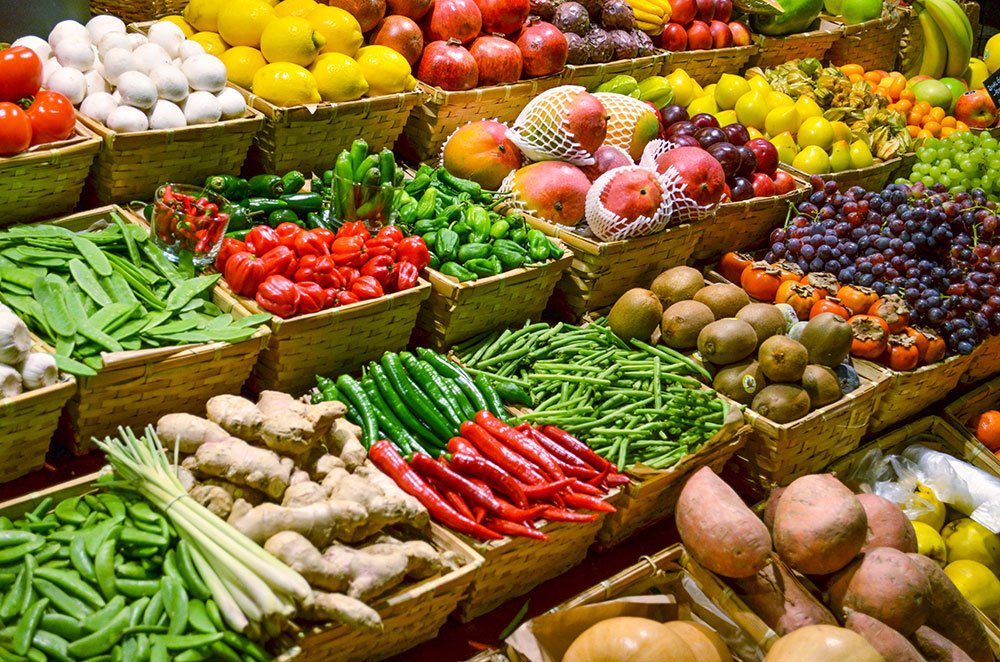

# Working on the front-end 
 # 🛒 Di Dwa Enterprise

Welcome to **Di Dwa Enterprise**, a sleek and user-friendly e-commerce platform for foodstuffs and groceries. Our goal is to bring the traditional provision shop experience online — fast, fresh, and accessible!

 <!-- (optional - change path or remove if not using an image) -->

---

## 🚀 Project Overview

**Di Dwa Enterprise** is a modern web application designed to let users:
- Explore categories like fresh produce, grains, and meats
- Search for products easily
- Track and manage orders
- Seamlessly navigate via mobile and desktop-friendly UI

This project is built with collaboration and scalability in mind using modern frontend tools.

---

## 🧰 Tech Stack

- ⚛️ **React.js** — JavaScript framework for building dynamic UIs
- 💨 **Tailwind CSS** — Utility-first CSS for rapid styling
- ✨ **ShadCN UI** — Prebuilt components for modern design
- 🌀 **SwiperJS** — Responsive image sliders and carousels
- 🎬 **Framer Motion** — Smooth animation handling

---

## 📸 Features

- ✅ Responsive Navigation Bar
- 🔍 Smart Search with category selector
- 🎞️ Auto and manual image slider
- 🧭 Drawer navigation on mobile but a website 
- 🛒 Shopping cart icon with interactivity

---

## 👥 Team & Contributions

This project is collaboratively built by a student team at [University of Ghana - Legon].  
Current active contributors:
- **Obeng Jessica Afriyie** (Frontend, UI/UX)
- **Opoku Christ Nana** (Full-Stack)

Want to contribute? Fork this repo, create a branch, and submit a Pull Request. 🎉

---

## 📦 Running the Project Locally on your machine

1. Clone the repository
```bash
git clone https://github.com/isra419/di-dwa-enterprise.git

 
